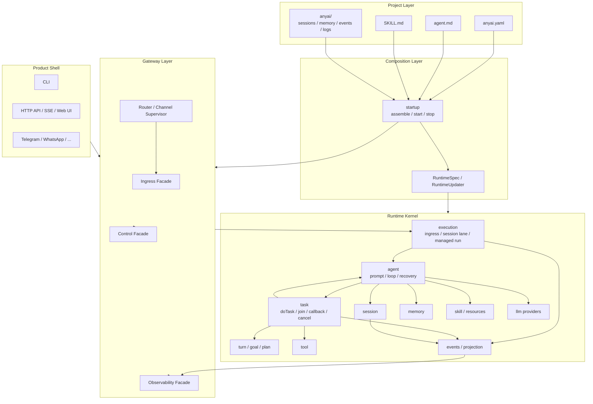

# AnyAI 设计文档

版本日期：2026-05-05

## 1. 文档目的

本文档是 AnyAI 的最终设计方案，用于统一描述 AnyAI 的产品定位、项目模型、运行时架构、多 Agent 协作、输入与会话模型、工具与安全、Prompt 与运行时智能增强、Turn/Goal 自驱机制、Memory/Skill 体系、事件与可观察性，以及后续实现和重构的判断标准。

本文档只关注最终设计本身，不讨论方案来源，也不把阶段性命名或临时实现路径作为设计本体。

AnyAI 的核心目标是：让非框架开发者也能以尽量低的门槛，构建可运行、可组合、可扩展的 AI Agent 系统。

AnyAI 的定位首先是一个 Agent 开发框架与运行时，而不是一个预置业务形态的现成产品。项目作者通过项目级 YAML 配置、`agent.md` 和 `SKILL.md` 来组装自己的 Agent 工程。

AnyAI 必须同时满足以下要求：

- 用 Markdown 定义 Agent，而不是要求用户先学习框架内部结构。
- 用 Agent 组合表达复杂任务，而不是额外引入一套工作流 DSL。
- 保持本地优先、单二进制、低依赖、易部署。
- 同时支持 CLI、HTTP/API、Web UI、消息渠道等多种运行形态。
- 保留技能、记忆、工具、会话、权限、安全、事件、可观察性等生产能力。
- 让运行时承担复杂性，让项目作者主要关注业务意图、角色、边界和交付物。

## 2. 产品与框架定位

AnyAI 是一个“项目优先”的 Agent Runtime Framework。

项目作者看到的是：

- `anyai.yaml`：项目级模型、Provider、runtime、memory、channel、安全与日志配置。
- `agent.md`：Agent 身份、模型、工具权限、workspace、系统指令与行为边界。
- `SKILL.md`：可复用能力说明，可按系统级、项目共享级、Agent 私有级装载。
- `anyai/`：运行时数据目录，承载 session、memory、events、logs 等长期状态。

项目作者不需要直接理解：

- runtime 内部 task 调度。
- run tree 和 projection 的维护方式。
- gateway facade 的拆分。
- provider transcript repair 的具体策略。
- event replay 和 session compact 的内部细节。

AnyAI 的用户心智应保持简单：

- 用 `agent.md` 定义 Agent。
- 用 `anyai.yaml` 定义项目运行参数。
- 用 `callagent` 连接 Agent。
- 用 `skills/` 和 `anyai/memory/` 提供可复用上下文。
- 用 Gateway 暴露的 CLI、HTTP、Web UI 或消息渠道运行系统。

## 3. 最终设计原则

### 3.1 Agent 是最小运行单元

一个目录中的一个 `agent.md` 定义一个 Agent。

`agent.md` 同时承担以下职责：

- Agent 身份定义。
- 系统指令主体。
- 模型选择入口。
- 工具权限入口。
- workspace 与行为边界声明。
- 当前 Agent 的业务目标、工作方式和输出要求。

AnyAI 不引入独立的 `workflow.md`、节点图文件或强制工作流 DSL。Agent 是最小行为单元，也是多 Agent 协作的基本节点。

### 3.2 Workflow 是受控 Agent 调用树

复杂任务的执行方式是：

- 入口 Agent 理解用户目标。
- 能直接完成的部分由入口 Agent 自行完成。
- 需要专业分工时，入口 Agent 调用其他 Agent。
- 子 Agent 在独立 run/session 语义下完成任务。
- 父 Agent 汇总结构化结果，继续推理或回答用户。

因此，AnyAI 的工作流不是额外系统，而是 runtime 管理的 `run/task/agent.call` 调用树。

### 3.3 Runtime 是 AnyAI 内核

AnyAI 的框架本体在 Runtime。Runtime 统一负责：

- Agent think-act loop。
- LLM Provider 适配。
- Tool 执行、恢复、重试和治理。
- Session、Transcript Hygiene、Compaction。
- Task / Agent / Tool / Process 编排。
- Turn 生命周期。
- Goal 自驱判断。
- Plan/Todo 工作状态。
- Memory、Skill、Resource Catalog。
- Events、Projection、Control、Daemon。

Runtime 不反向依赖 Gateway、Channel、HTTP 或 Web UI。

### 3.4 Gateway 是统一外部暴露层

所有外部输入必须先进入 Gateway，再进入 Runtime。

这条规则适用于：

- CLI。
- HTTP API / SSE / Web UI。
- Telegram。
- WhatsApp。
- 后续 Slack、Feishu、Discord 等消息渠道。

HTTP 不是绕过 Gateway 的特殊入口。CLI 也不是直连 Runtime 的旁路。它们都是 Gateway 管理或使用 Gateway 暴露面的产品入口。

### 3.5 Channel 只做接入与展示适配

Channel 的职责是：

- 接收外部消息或请求。
- 转换为标准输入 envelope。
- 通过 Gateway 提交输入。
- 消费 Gateway 的事件、状态和回复。
- 按渠道形态展示结果。

Channel 不承载：

- Agent 编排。
- Tool 调度。
- Session lane。
- Memory lifecycle。
- Task join / callback / timeout。
- Runtime 事实事件生成。

### 3.6 Markdown 优先，Runtime 承担复杂性

`agent.md` 主要表达业务意图、角色、原则、边界和交付要求。

Runtime 负责补齐：

- 工具真实可用能力与边界。
- 项目根、workspace、sessions、memory、agent 目录等环境事实。
- 当前请求焦点。
- Skill 和 Memory 召回。
- 工具失败后的恢复建议。
- Transcript 合法性与上下文卫生。
- 多 Agent 协作契约。
- Goal、Plan、Todo 等长期任务状态。

AnyAI 的智能提升来自“Prompt 骨架 + 运行时事实 + 工具恢复 + Session Hygiene + 可观察性 + 自驱机制”的组合，而不是单纯把系统提示词写长。

## 4. 总体架构

### 4.1 顶层分层

AnyAI 的目标架构分为五层：

```text
Project Layer
  registry / config / agent.md / SKILL.md
  把项目定义解析成 Runtime 可消费的配置与资源目录

Composition Layer
  startup
  assemble / start / stop / watcher wiring / updater wiring

Gateway Layer
  ingress facade
  control facade
  observability facade
  channel supervisor / router

Product Shell
  CLI
  HTTP API / SSE / Web UI
  Telegram / WhatsApp / future channels

Runtime Kernel
  execution
  agent
  task / turn / goal / plan
  tool
  session
  memory
  resources / skill
  events / projection / control / daemon
```

核心边界：

- `registry/config` 负责项目定义解析。
- `startup` 是 composition root，只负责组装和生命周期启动。
- `gateway` 暴露 Runtime 的控制面和观测面，并承担路由与 channel supervisor。
- `channel` 和 HTTP/Web UI 是产品壳或适配层。
- `runtime` 是 AnyAI 的框架内核。

### 4.2 架构图



### 4.3 核心模块职责

| 层 | 模块 | 职责 |
| --- | --- | --- |
| CLI | `cmd` | `chat`、`start`、`init`、`version` 等命令入口 |
| 项目解析 | `internal/registry`、`internal/config` | 扫描 `agent.md`，合并 `anyai.yaml`，生成运行时配置与项目布局 |
| 启动装配 | `internal/startup` | 组装 runtime、gateway、channel、HTTP、daemon、watcher |
| Gateway | `internal/gateway` | ingress、routing、control、observe、replay、channel manager |
| HTTP 产品壳 | `internal/startup/http` 或后续产品壳目录 | REST API、SSE、Web UI、metrics |
| Channel | `internal/channel` | CLI、Telegram、WhatsApp 等渠道适配 |
| Runtime 内核 | `internal/runtime` | Agent、Task、Turn、Goal、Tool、Session、Memory、Skill、Events、Projection |

## 5. Agent 项目模型

### 5.1 推荐目录结构

```text
project/
├── anyai.yaml
├── agent.md
├── skills/
├── common/
│   └── skills/
├── agents/
│   ├── coder/
│   │   ├── agent.md
│   │   └── skills/
│   ├── reviewer/
│   │   ├── agent.md
│   │   └── skills/
│   └── tester/
│       └── agent.md
└── anyai/
    ├── sessions/
    ├── memory/
    │   ├── candidates/
    │   ├── episodic/
    │   └── long-term/
    ├── events/
    └── runtime.log
```

目录规则：

- `anyai.yaml` 可选，但用于项目级运行配置。
- 一个目录中出现 `agent.md`，该目录就定义一个 Agent。
- 项目根目录中的 `agent.md` 是默认入口候选。
- 根目录之外的 `agent.md` 默认视为可被调用的子 Agent，也可以通过显式入口规则成为入口。
- `<agent_dir>/skills/` 是 Agent 私有技能目录，只对当前 Agent 可见。
- `<project>/common/skills/` 是项目共享技能目录，存在时自动识别。
- `<project>/anyai/memory/` 是正式项目级记忆目录。
- `anyai/memory/candidates/` 存放候选记忆或待治理素材。
- `anyai/memory/episodic/` 存放阶段性摘要。
- `anyai/memory/long-term/` 存放稳定事实、规则、决策和长期偏好。
- 历史 `memory/*.md`、`memory/entries/*.md` 等布局只作为兼容来源，不再是推荐主路径。

AnyAI 不使用 `main_agent.md`。入口由运行时解析规则决定。

### 5.2 `anyai.yaml`

`anyai.yaml` 的职责是项目运行配置，不替代 `agent.md`，也不负责声明 Agent 扫描目录。

推荐字段：

| 字段 | 说明 |
| --- | --- |
| `name` | 项目名称 |
| `models.default` | 默认模型 |
| `models.aliases` | 模型别名 |
| `providers` | Provider 配置，通常引用环境变量而不是直接写密钥 |
| `env` | 运行时所需环境变量声明或映射 |
| `runtime` | 超时、Agent 调用深度、并发上限、工具恢复、session queue、compaction 等 |
| `memory` | 记忆启用、目录、注入上限、回忆策略、写回策略 |
| `channels` | Gateway 启用哪些渠道，以及各渠道监听参数 |
| `security` | 审批、路径限制、网络访问、DM/group policy 等安全策略 |
| `logging` | 文件日志、stderr、rotation 和渠道库日志配置 |

示例：

```yaml
name: ecommerce-support

models:
  default: anthropic/claude-sonnet-4-5
  aliases:
    fast: openai/gpt-4.1-mini
    strong: anthropic/claude-sonnet-4-5

providers:
  anthropic:
    api_key_env: ANTHROPIC_API_KEY
  openai:
    api_key_env: OPENAI_API_KEY

runtime:
  idle_timeout_ms: 120000
  agent_call:
    depth_limit: 4
    max_parallel: 4
  tools:
    max_attempts: 2
    retry_backoff_ms: 500
    loop_detection: true
    preflight: true
  sessions:
    queue_mode: collect
    transcript_hygiene:
      enabled: true

memory:
  enabled: true
  inject:
    max_items: 3

channels:
  gateway:
    enabled:
      - cli
      - http

security:
  approvals:
    exec: ask
```

### 5.3 `agent.md`

`agent.md` 由 YAML frontmatter 和 Markdown 正文组成。

推荐 frontmatter 字段：

| 字段 | 说明 |
| --- | --- |
| `id` | Agent 唯一 ID，缺省时按目录名推导 |
| `name` | 展示名 |
| `description` | 职责说明 |
| `entry` | 是否是目录模式入口 |
| `model` | 当前 Agent 模型，缺省时使用项目默认模型 |
| `fallbacks` | 模型 fallback 列表 |
| `workspace` | 工具执行工作目录，必须在项目根内 |
| `max_turns` | 单 run 最大模型/工具循环轮数 |
| `tools.allow` | 允许工具 |
| `tools.deny` | 禁止工具 |
| `skills.inherit_shared` | 是否继承项目共享技能，默认 true |
| `tags` | 展示、推荐、路由辅助标签 |

正文是 Agent 的行为主体。Runtime 不把正文解析成工作流图，只把它作为 Agent 指令参与 Prompt 组装。

示例：

```markdown
---
id: reviewer
name: Code Reviewer
description: Reviews code changes and identifies correctness risks.
model: strong
workspace: .
tools:
  allow:
    - read_file
    - bash
    - callagent
skills:
  inherit_shared: true
---

你负责审查代码变更，优先发现 correctness bug、回归风险和测试缺口。

输出时先列发现的问题，再列必要的开放问题。不要把风格建议放在真正的 bug 前面。
```

### 5.4 入口选择规则

目录模式入口解析顺序：

1. 命令行或 API 显式指定 Agent ID 时使用该 Agent。
2. 唯一 `entry: true` Agent。
3. 项目根目录 `agent.md`。
4. 项目中只有一个 Agent 时自动使用它。
5. 多 Agent 且无法唯一确定入口时启动失败，并列出可选 ID。

文件模式：

- 目标路径是 `agent.md` 时，该文件对应 Agent 是显式入口。
- 文件模式会向上查找最近的 `anyai.yaml` 作为项目根。
- 找不到 `anyai.yaml` 时按单 Agent 项目处理。
- 文件模式不可再额外指定 Agent override。

### 5.5 Registry 合并规则

Registry 负责把项目文件解析为 Runtime 可消费的项目规格。

Registry 必须：

- 解析项目根。
- 读取 `anyai.yaml`。
- 扫描所有 `agent.md`。
- 校验重复 Agent ID。
- 校验 `workspace` 不越出项目根。
- 解析共享技能、私有技能和 memory 目录。
- 合并项目模型别名、Provider、runtime、memory、channel、安全配置。
- 生成 Runtime 可消费的配置、资源目录和 Agent 清单。

项目扫描逻辑不应散落到 startup、gateway 或 runtime 执行路径中。

## 6. 启动、装配与热更新

### 6.1 Composition Root

`startup` 是 composition root，只负责装配和生命周期管理。

它负责：

- 读取或接收项目配置。
- 构建 RuntimeSpec。
- 初始化 Provider、Session Store、Tool Registry、Skill Loader、Memory Manager、Recorder、Task Runtime、Turn Store。
- 包装 Runtime。
- 构建 Gateway。
- 注册 Channel。
- 启动 HTTP service。
- 启动 daemon。
- 启动 project/config watcher。

它不应承载：

- Agent 编排。
- Tool 调度。
- Session queue 策略实现。
- Memory 生命周期治理。
- Task join / callback / timeout 编排。

### 6.2 RuntimeSpec

RuntimeSpec 是一次完整运行时规格的内部表达。

```go
type RuntimeSpec struct {
    Config    *config.Config
    Layout    ProjectLayout
    Providers map[string]llm.LLMProvider
    Resources *resources.Catalog
    Skills    *skill.Loader
}
```

热更新数据流应收敛为：

```text
project changed
  -> registry.LoadProject
  -> factory.BuildRuntimeSpec
  -> runtime.ApplySpec
  -> gateway.ApplyRuntimeView
```

这样 startup 不需要手写一组分散 setter。

### 6.3 RuntimeUpdater

RuntimeUpdater 负责把新的项目配置应用到 Runtime 和 Gateway。

它负责：

- rebuild resource catalog。
- update runtime dependencies。
- update skill loader。
- update memory config。
- emit config/resources/skills lifecycle events。
- notify gateway rebuild router。

Watcher 只负责发现变化并调用 updater，不直接修改 runtime 组件。

## 7. Gateway、Channel 与 HTTP 产品壳

### 7.1 Gateway 职责

Gateway 是 Runtime 对外暴露层。

Gateway 负责：

- 统一入口暴露。
- Runtime 控制面暴露。
- Runtime 观测面暴露。
- Channel supervisor。
- Router。
- 接入策略和渠道策略。
- run/session/task/memory/config/log 等查询面聚合。

Gateway 不负责：

- Agent 调度。
- Tool 调度。
- Session lane。
- Memory maintenance。
- Task join / callback / timeout 编排。

### 7.2 Gateway Facade

Gateway 对外应拆成更窄的 facade，而不是让所有使用方依赖一个过宽服务对象。

目标 facade：

- Ingress Facade：处理 agent resolve、输入提交、run 启动。
- Observe Facade：处理 run、trace、session、task、event replay 查询。
- Control Facade：处理 cancel、compact、memory maintenance、task control。
- Channel Supervisor Facade：处理 channel 注册、启动、停止、状态查询。

Channel 通常只依赖 ingress/observe。HTTP API 和 Web UI 按模块依赖所需 facade。

### 7.3 Channel 职责

Channel 只通过 Gateway 交互。

Channel 负责：

- 接收外部输入。
- 规范化输入。
- 提交到 Gateway。
- 订阅事件或 replay。
- 展示回复、状态、错误和进度。

新增 Slack、Feishu、Discord 等渠道时，只新增 channel adapter，不改 runtime 内核。

### 7.4 HTTP/API/Web UI

HTTP API、SSE、Web UI、metrics 是产品壳。它们通过 Gateway 使用 Runtime 能力，不属于 Runtime 内核。

HTTP 平面应按能力拆分：

- RunPlane。
- SessionPlane。
- MemoryPlane。
- TaskPlane。
- RuntimePlane。
- ConfigPlane。
- LogPlane。

这样新增 memory、task、job 或 config 能力时，不会污染所有 API 路由的共同接口。

## 8. 统一输入模型

### 8.1 InputEnvelope

所有外部输入都应被规范化为统一输入 envelope，再进入 Runtime。

InputEnvelope 应表达：

- 输入来源渠道。
- Agent/session 定位信息。
- 用户文本。
- 附件。
- 图片。
- 结构化 metadata。
- 当前请求 ID。
- 是否来自 queued message 或 interrupt。

输入模型的目标不是替代 Agent Prompt，而是让 Runtime 在进入 session 前有机会执行：

- 路由。
- 权限检查。
- session busy queue。
- attachment 解析。
- request focus 标记。
- event 记录。

### 8.2 输入生命周期

标准输入生命周期：

```text
input.received
  -> input.normalized
  -> run.routed
  -> run.queued 或 run.started
  -> session.input_stored
  -> agent processing
```

queued message 在真正被 dispatch 成新一轮 run 之前，不应作为普通 user message 写入 session transcript。

### 8.3 输入工具

Agent 可通过输入相关工具读取本轮附件、图片、结构化输入或上游产物。

输入工具必须遵守：

- 附件读取受 workspace 和安全策略约束。
- 大文件应使用摘要、切片或显式读取。
- 上游产物路径应作为协作契约或 environment fact 注入。
- 输入 metadata 不应被隐式当作用户文本。

## 9. Agent Runtime 与 Prompt 架构

### 9.1 Prompt 分层

AnyAI 的系统 Prompt 是“框架拥有的稳定骨架 + Agent 自定义内容 + 动态检索内容”。

高层顺序：

```text
Agent Instructions
Runtime Identity
Runtime Contract
Runtime Capabilities
Environment Facts
Collaboration Contract
Current Request Focus
Relevant Skills
Relevant Memory
```

其中：

- `Agent Instructions` 来自 `agent.md`。
- `Runtime Identity` 说明当前运行时身份和边界。
- `Runtime Contract` 是框架拥有的硬规则。
- `Runtime Capabilities` 说明本轮真实工具能力和边界。
- `Environment Facts` 注入项目路径和目录事实。
- `Collaboration Contract` 注入父子 Agent 协作语义。
- `Current Request Focus` 明确当前真正要推进的问题。
- `Relevant Skills` 注入匹配到的技能摘要，并支持按需读取完整内容。
- `Relevant Memory` 注入召回记忆，并声明其优先级低于当前用户目标。

### 9.2 Runtime Contract

Runtime Contract 应短而硬，至少覆盖：

- Runtime 提供的工具是真实可用能力，不是建议文本。
- 优先自己推进任务，而不是把工具调用格式反过来问用户。
- 工具失败后必须读取具体错误，调整参数、路径或方法后继续推进。
- 遇到路径歧义时优先使用注入的绝对路径信息。
- 遇到目录检查、批量检查、复杂转换时，优先考虑 `bash`。
- 当工作流更复杂时，可以通过 `bash` 写短脚本，必要时写短 Python 程序再执行。
- 如果已经生成长文产物且有保存工具，应尽快持久化到文件。
- 如果调用了子 Agent，必须等待 Runtime 回注的结果后再总结。
- 如果认为 Goal 完成，应通过完成确认工具或明确完成语义让 Runtime 验证。

### 9.3 Runtime Capabilities

能力描述不只是列工具名，而要说明工具边界与常见转向。

示例原则：

- `read_file` 读取文件内容，不读取目录；路径是目录时应切换到 `bash` 检查目录。
- `bash` 可用于检查目录、查找文件、验证路径、执行短脚本、运行 Python 辅助程序。
- `callagent` 用于调用其他 Agent；Runtime 会统一跟踪、回调和汇聚结果。
- `update_plan` / `todo` 用于维护 session 级工作状态，而不是替代 task runtime。
- `memory_save` 用于显式保存长期有价值的信息，不应用来记录每个临时中间状态。

工具语义必须清晰，不通过“偷偷扩展工具职责”来弥补模型理解问题。

### 9.4 Environment Facts

Runtime 应注入真实路径和目录事实，包括：

- 项目根目录。
- 当前 Agent workspace。
- 当前 Agent 定义目录。
- 配置文件路径。
- `anyai/` 数据目录。
- `anyai/sessions/`。
- `anyai/memory/`。
- 可调用 Agent 根目录，例如 `agents/`。
- 共享技能目录，例如 `common/skills/`。
- 当前任务推荐输出目录或产物路径。
- 上游已产出的文件路径摘要。

目标是让模型在第一步就知道：

- 应该去哪里找 session。
- 应该去哪里找 memory。
- 当前相对路径基于哪里。
- 当前任务产物应该写到哪里。

### 9.5 Collaboration Contract

多 Agent 场景必须有结构化协作契约。

子 Agent 至少应知道：

- 当前自己是入口 Agent 还是子 Agent。
- 上游给自己的任务是什么。
- 自己的 workspace 是什么。
- 预期输出是什么。
- 输入产物有哪些。
- 结果应该返回文本、写文件，还是两者都要。

Agent 调用契约应包含：

- `task_goal`。
- `workspace`。
- `expected_outputs`。
- `input_artifacts`。
- `return_mode`。

如果只是返回文本，不应假设文件已经落盘。如果要求文件交付，路径必须明确。

### 9.6 Current Request Focus

Runtime 必须显式维护当前请求焦点，而不是让模型从脏 transcript 尾部猜。

Request Focus 应从以下信息生成：

- 当前 inbound user message。
- session 中未清洗的历史尾部。
- queued message 合成输入。
- 最近工具结果相关追问。
- 当前 run 的输入 metadata。

Request Focus 应驱动：

- Prompt 中的当前请求 section。
- Skill 匹配。
- Memory recall。
- Retrieval query。
- Follow-up 合成文本的主次关系。

当多条 queued message 被 collect 成一个输入时，应明确区分：

```text
[Earlier pending user turns for context]
...

[Current message - respond to this]
...
```

### 9.7 Transcript Hygiene

送模前必须执行 request-local transcript hygiene。它不直接改写磁盘 session，而是在本次请求即将送模的消息数组上修复非法或高度误导的结构。

Transcript Hygiene 至少覆盖：

- 连续 user turn 合并或上下文折叠。
- orphaned tool result 丢弃或修复。
- assistant tool call 缺少 tool result 时补 synthetic error result。
- compaction summary 不再作为普通 user turn 注入，而是作为 summary context。
- provider-aware role ordering 检查。

这层不修改用户原文，不改变工具语义，只修复对模型/provider 来说非法或误导的 transcript 结构。

### 9.8 Tool Preflight

工具真正执行前，Runtime 应执行确定性的 preflight repair。

可修复内容：

- tool name trim / case normalization。
- 字符串包裹的 JSON 参数解包。
- 明确声明的字段别名映射。
- 空对象、空字符串、明显无效 payload 的统一拒绝。

边界：

- 只做确定性 repair。
- 不做猜测型 repair。
- 只有 tool 明确声明支持的别名/修补逻辑才能启用。
- repair metadata 应进入 tool result、session、trace 和 UI。

推荐 metadata：

- `repair_applied`。
- `repair_notes`。
- `original_tool_name`。
- `original_input_summary`。

### 9.9 工具失败恢复

工具失败是一等运行时信号。

失败结果必须结构化并持久化，至少包含：

- `tool_name`。
- `input_summary`。
- `error_message`。
- `error_class`。
- `retryable`。
- `suggested_next_moves`。

典型 `error_class`：

- `path_not_found`。
- `path_is_directory`。
- `permission_denied`。
- `validation_error`。
- `timeout`。
- `network_error`。
- `transient_provider_error`。
- `loop_detected`。
- `unknown`。

恢复分两层：

- 基础设施级 retry：对瞬时性 LLM/provider/tool transport 错误做有限自动重试。
- Agent 级恢复：把结构化失败观察喂给模型，由模型决定换参数、换工具、换路径或换方法。

不应自动重试：

- 参数校验错误。
- 路径不存在。
- 路径是目录但工具期望文件。
- 权限不足。
- 明确业务失败。

这些错误应直接交给模型调整策略。

### 9.10 Loop Guard

当模型连续执行“同一工具 + 相同参数 + 相同错误”时，Runtime 应主动介入。

Loop Guard 分两层：

- 提示层：返回高优先级运行时观察，提醒模型正在重复无效调用。
- 阻断层：达到阈值时阻止继续相同调用，要求改参数、改路径或改工具。

应覆盖：

- `generic_repeat`：同一工具、同一参数、重复相同失败或相同结果。
- `known_poll_no_progress`：轮询类工具长时间无进展。
- `ping_pong`：两个工具来回切换但状态没有推进。

### 9.11 Incomplete Turn Recovery

Runtime 必须识别并收口不完整轮次。

触发场景：

- LLM stream 在出现 meaningful output 后异常结束。
- 本轮出现 tool call，但没有形成完整 assistant reply 或 tool feedback。
- run 终止时存在 pending tool call。
- 最终没有 user-facing payload，但本轮已经进入执行阶段。

处理规则：

- 生成稳定 fallback assistant message。
- 如果可能涉及副作用工具，提示用户先核实部分副作用。
- fallback 回复进入 session。
- 发出 `run.incomplete`、`run.fallback_reply` 等事件。

目标不是美化错误，而是避免 Runtime 失败后用户看到空白，session 尾部也没有明确收口。

### 9.12 Runtime Hooks

Runtime 应提供 Go 风格 hook，而不是重量级插件系统。

推荐 hook：

- `BeforePromptBuild`。
- `BeforeModelResolve`。
- `BeforeToolCall`。
- `AfterToolCall`。
- `ToolResultShape`。
- `LoopDetect`。
- `BeforeCompaction`。
- `AfterCompaction`。
- `AgentEnd`。

Hook 可以增强 Runtime，但默认行为仍由 Runtime 主链路负责。Hook 不应反向夺走 `agent.md` 作为主要作者界面的地位。

## 10. 统一任务编排：doTask

### 10.1 核心判断

AnyAI 不再把“调用子 Agent”“后台任务”“并行工具”“外部进程”拆成多套编排系统。

统一原则：

```text
task.Runtime.DoTask(...) 是 Runtime 内部唯一任务提交原语
```

`doTask` 至少覆盖：

- `agent`：调用另一个 Agent。
- `tool`：执行一个工具，包括单 tool 与 batch tool。
- `process`：执行 bash、python、外部脚本或长耗时系统任务。

未来可扩展：

- `workflow`。
- `http`。
- `daemon_job`。

### 10.2 对模型暴露的协作工具

模型侧可以保留易理解的 `callagent` 工具名。

但在 Runtime 内部，`callagent` 只是：

```text
callagent
  -> build TaskSpec(kind=agent)
  -> task.Runtime.DoTask(...)
  -> callback / join
  -> result injected back to parent agent
```

`callagent` 不应持有独立依赖图，不应成为影子运行时。

### 10.3 对外稳定语义

Runtime 对 Gateway 暴露的任务语义只保留：

- `doTask`：创建并启动任务。
- `taskStatus`：查询任务状态与结果。
- `cancelTask`：取消任务。

不作为主路径继续扩展：

- `task_wait`。
- `mode="background"`。
- `mode="parallel_background"`。
- 轮询式 follow-up 编排。
- Agent 调用专属后台链路。

如需兼容旧输入，只能在边缘层作为短期 alias，不能污染内部结构。

### 10.4 Callback 与 Join

父调用方提交子任务后，不手写等待循环。Runtime 在子任务完成、失败或取消后，主动回调并恢复父调用方后续流程。

规则：

- 单子任务：完成后回调父调用方，继续后续推理。
- 并发子任务：Runtime 创建 join，等待 all-settled 后一次性恢复父调用方。
- 失败任务：以结构化失败结果回注给父调用方，由 Agent 决定恢复策略。
- 父调用取消：取消传播到相关子任务。

这套规则同时适用于：

- 多 Agent 并发。
- Batch tool 并发。
- 多 process 并发。

### 10.5 失败、超时与取消

统一要求：

- tool 失败不应直接导致整个 Agent 工作流无条件中断。
- task 失败要有标准失败事件与结构化错误返回。
- Agent 可以根据失败结果切换策略或退化方案。
- Runtime 负责提供清晰可见的失败上下文。
- 默认超时足够长。
- 活跃任务可通过 Turn activity 自动续租。
- 父调用取消时，取消传播给相关子任务。
- 明确不再等待结果时，必须通过 Runtime 取消对应 task。

## 11. Turn 生命周期

### 11.1 Turn 是统一生命周期单元

Turn 是一组相关任务的统一生命周期管理单元。

它解决的问题：

- 子任务活跃但父任务超时。
- 多层 task 各自维护 timeout 导致状态不一致。
- activity 递归传播复杂。
- 取消传播和完成判断分散。

Turn 设计：

- 一个 Turn 有统一 context。
- Turn 内所有 task 从 Turn context 派生。
- Turn 内任何任务 activity 都保活整个 Turn。
- Turn 取消时，所有子任务自动取消。
- Turn 完成时，释放相关任务引用。

### 11.2 Turn 数据模型

Turn 至少包含：

- `ID`。
- `SessionID`。
- `ParentTurnID`。
- `State`：`active`、`completed`、`cancelled`、`timed_out`。
- `Timeout`。
- `CreatedAt`。
- `StartedAt`。
- `CompletedAt`。
- `LastActivityAt`。
- `Context` / `CancelFunc`。
- 当前注册 task 集合。

Task record 应带 `TurnID`，用于 projection、debug 和取消传播。

### 11.3 Activity 传播

旧的 task 级 `IdleTimeoutMS` 和 `LastActivityAt` 不应再作为长期权威机制。

目标机制：

```text
Task / Tool / Agent / Process activity
  -> runtimeactivity hook
  -> Turn.Touch()
  -> reset Turn idle timer
```

效果：

- 子任务活跃自然保活父级工作。
- 不需要递归 Touch parent task。
- 所有子任务共享 Turn 生命周期。
- UI 可以按 Turn 展示当前活跃状态。

### 11.4 兼容策略

为了兼容已有 API 和历史数据：

- `IdleTimeoutMS` 可以短期保留字段。
- `LastActivityAt` 可以短期由 Turn activity 回填。
- 新逻辑不应再依赖 task 独立 idle timeout 作为权威判断。

## 12. Goal 自驱与 Plan/Todo

### 12.1 Goal Runtime

Goal 是 Runtime 对“当前要达成的目标”的客观记录，不是模型的主观感觉。

Goal 状态：

- `in_progress`：进行中。
- `awaiting_input`：等待用户输入。
- `completed`：已完成，且 Runtime 已确认。
- `abandoned`：已放弃。

Goal 至少包含：

- `ID`。
- `SessionID`。
- `Description`。
- `State`。
- `TurnID`。
- `CreatedAt`。
- `StartedAt`。
- `CompletedAt`。
- `TurnCount`。
- `ToolCalls`。
- `Checkpoints`。
- `PendingTasks`。

### 12.2 Runtime 主导完成判断

完成判断由 Runtime 基于客观事实主导，模型负责“如何继续”。

决策优先级：

1. Hard Constraints。
   - 最大轮次耗尽：强制终止。
   - 全局超时：强制终止。
   - 系统错误或资源不足：强制终止。
   - 用户取消：强制终止。
2. Objective Facts。
   - 有未完成任务：必须继续。
   - 有待处理工具调用：必须继续。
   - Checkpoint 未完成：建议或强制继续。
3. Completion。
   - Runtime 确认无未完成任务。
   - 模型声明完成。
   - Runtime 允许或拒绝完成声明。

冲突处理：

| 场景 | Runtime 判断 | 模型声明 | 结果 |
| --- | --- | --- | --- |
| 硬约束触发 | 必须停止 | 任意 | 强制终止 |
| 有未完成任务 | 应继续 | 想完成 | 拒绝完成并继续 |
| 无未完成任务 | 可完成 | 想完成 | 允许完成 |
| Checkpoint 未完成 | 应继续 | 想完成 | 拒绝完成并继续 |

### 12.3 自驱继续

当一轮 Agent 输出结束时，Runtime 应检查当前 Goal 是否真正完成。

如果仍应继续：

- 发出 `goal.should_continue` 事件。
- 构造 continuation prompt。
- 将未完成原因、阻塞任务、未完成 checkpoint 回注给 Agent。
- 继续下一轮，而不是直接关闭 run。

如果不应继续：

- 标记 Goal 完成或终止。
- 正常收口 run。

### 12.4 Goal 工具

推荐提供 `goal_complete` 工具，让模型显式声明“我认为目标已完成”。

Runtime 必须验证：

- 是否还有 pending tasks。
- 是否还有 pending tool calls。
- checkpoint 是否全部完成。
- 是否达到 hard constraints。

验证失败时，工具返回结构化未完成原因，Agent 必须继续处理。

### 12.5 Plan/Todo 是 Session 级工作状态

Plan/Todo 是 session 级 workflow state，不是一次 run 内的临时变量。

它要解决：

- `plan`：保存当前复杂任务的整体计划、阶段和约束。
- `todo`：保存可执行项及其完成状态，支持跨 turn 持续跟踪。

必须满足：

- run 内可写。
- session 内持久。
- event log 可重放。
- compact 后不丢状态。
- projection / query 可读取当前快照。

### 12.6 Plan/Todo 数据原则

Plan/Todo 的权威状态在 session。

原则：

- session entry 是状态事实源。
- event log 是可重建事实源。
- tool 层只依赖 session 接口。
- compact / replay / branch 不丢状态。
- projection 要能读取当前快照。
- task 编排可以与 todo 联动，但 todo 不成为 task runtime 的附属状态。

推荐事件：

- `session.plan.updated`。
- `session.todo.updated`。

### 12.7 Structured Plan

长期方向是把纯文本 Plan/Todo 升级为结构化计划视图，但不要求项目作者学习工作流 DSL。

结构化 Plan 可包含：

- `PlanID`。
- `GoalID`。
- `Description`。
- `Steps`。
- `Dependencies`。
- `State`。
- `Evidence`。

Step action 可映射到：

- tool。
- agent。
- process。
- user_input。
- checkpoint。

结构化 Plan 是 Runtime 的执行与观测增强，不是新的作者入口。

## 13. Session 与长期运行

### 13.1 Session 是 Working Memory

Session 是 Agent 的工作记忆，不是 channel 的临时上下文。

Session 负责：

- transcript 持久化。
- tool call / tool result 配对。
- plan/todo 状态。
- compact。
- branch。
- replay。
- 当前 session state view。

Session 必须支持 per-agent 管理。

### 13.2 Session Entry

Session entry 应能表达：

- user message。
- assistant message。
- tool call。
- tool result。
- plan。
- todo。
- summary/meta。
- memory capture。
- fallback reply。
- system/runtime marker。

Tool result entry 必须持久化 metadata，使错误分类、repair notes、retry 信息、warning、images 等能跨 turn 保留。

### 13.3 Rolling Session Summary

当 session 过长时，Runtime 应执行 rolling summary。

要求：

- summary 不作为普通 user turn 注入。
- summary 作为独立 context 参与 Prompt。
- 最新 plan/todo snapshot 必须保留。
- 未完成 tool pair 必须先修复或合成结果。
- summary 中应保留关键目标、决策、文件路径、用户约束、未完成事项。

### 13.4 Session Busy Queue

同一 session 同时只允许一个 active run。

当 active run 存在时，新输入进入队列策略：

- `collect`：合并多条 pending message，在当前 run 结束后作为一条 follow-on 输入。
- `followup`：前一轮完成后逐条启动新 run。
- `interrupt`：中止当前 run，把最新消息作为下一轮当前问题。

关键规则：

- queued message 在真正 dispatch 前不写入 transcript。
- collect 合成输入必须明确当前主问题。
- interrupt 必须产生可观察事件，并正确取消当前 run/task/turn。

这里的 follow-up 是 session queue 策略，不是 task 编排主路径。

## 14. Skill 系统

### 14.1 Skill 层级

Skill 是一等行为上下文，但不是工具执行本身。

Skill 层级：

- 系统级 Skill。
- 项目共享 Skill：`common/skills/`。
- Agent 私有 Skill：`<agent_dir>/skills/`。

可见性规则：

- Agent 私有 Skill 只对当前 Agent 可见。
- 项目共享 Skill 对继承共享技能的 Agent 可见。
- 系统级 Skill 可由运行时按策略提供。

### 14.2 Metadata First

Skill 加载采用 metadata-first、body lazy load。

Runtime 先注入：

- skill 名称。
- 描述。
- 适用场景。
- source。
- 摘要。

当模型决定使用某个 Skill 时，再通过 `skill_get` 或等价机制读取完整内容。

这样可以降低 token 成本，也避免把无关 Skill 全量塞进 Prompt。

### 14.3 Resource Catalog

Resource Catalog 汇总：

- Agent metadata。
- Tool metadata。
- Skill metadata。
- Memory scope。
- Capability metadata。

Resource Catalog 可以包含 no-op capability provider 用于描述能力，但必须明确它们只是 metadata，不是真实运行时依赖。

真实可执行性以 run 注入的依赖和 tool registry 为准。

## 15. Memory 系统

### 15.1 三层记忆

AnyAI 的 Memory 分为三层：

- Session Memory：当前会话工作记忆，由 session 承载。
- Episodic Memory：阶段性摘要、任务经历、阶段结果。
- Long-term Memory：稳定事实、规则、长期偏好、项目决策。

推荐目录：

```text
anyai/memory/
├── candidates/
├── episodic/
└── long-term/
```

### 15.2 读取路径

Memory recall 应围绕 current request focus，而不是整段 transcript。

读取流程：

```text
current request focus
  -> memory query
  -> retrieve candidates
  -> rank / filter
  -> inject relevant memory
```

注入原则：

- Memory 是辅助约束，不覆盖当前明确用户目标。
- 注入数量有限。
- 标明来源和作用范围。
- 与当前目标冲突时，以当前用户输入和项目配置优先。

### 15.3 写回路径

Memory 写回应以显式保存为主，自动捕获为辅。

可写入内容：

- 用户明确偏好。
- 长期有效的项目事实。
- 已确认决策。
- 稳定工作流程。
- 重要外部系统约束。

不应写入：

- 临时推理草稿。
- 一次性错误细节。
- 未确认猜测。
- 敏感信息，除非配置明确允许。

### 15.4 Memory 治理

Memory 系统应支持：

- recall。
- save。
- promotion。
- stale cleanup。
- reindex。
- scope 管理。
- daemon maintenance。

后续可以允许 daemon agent 参与记忆维护，但 memory lifecycle 的权威仍在 Runtime。

## 16. 工具体系与安全

### 16.1 工具分类

工具按能力分为：

- 文件工具：读写文件、列目录、搜索。
- 命令工具：bash、process、脚本执行。
- Agent 工具：`callagent`。
- Session 工具：plan、todo、summary、input。
- Memory 工具：recall、save、maintenance。
- Skill 工具：skill list/get。
- 网络工具：HTTP fetch、web search 等可选能力。
- 控制工具：cancel、status、goal complete 等受限能力。

### 16.2 Tool Policy

工具权限由项目配置与 Agent 配置共同决定。

规则：

- 项目安全策略是上限。
- Agent `tools.allow` / `tools.deny` 是当前 Agent 的工具边界。
- 高风险工具必须支持审批。
- 工具结果必须结构化记录。
- 副作用工具必须能在 incomplete turn fallback 中提示风险。

### 16.3 文件与命令安全

文件与命令工具必须遵守：

- workspace 限制。
- 项目根边界。
- 禁止路径越权。
- 敏感文件保护。
- 命令审批。
- 超时与取消。
- 环境变量最小暴露。
- 网络访问控制。

对于命令执行：

- 默认工作目录必须明确。
- 长耗时任务应走 task/process runtime。
- stdout/stderr 应可摘要、截断和持久化。
- 取消必须传播到实际进程。

### 16.4 外部访问安全

网络访问能力必须支持：

- allowlist / denylist。
- SSRF 防护。
- timeout。
- response size limit。
- redirect policy。
- secret redaction。

Provider API key 应通过环境变量或安全配置注入，不应硬编码在项目文件中。

### 16.5 工具语义不偷改

工具失败恢复不应靠偷改工具语义实现。

例如：

- `read_file` 只读文件，不读目录。
- 目录检查应通过 `bash`、目录工具或搜索工具完成。
- `memory_save` 保存长期有价值的信息，不保存所有中间日志。
- `callagent` 调用 Agent，不直接伪装成 workflow DSL。

工具边界越清晰，模型行为越稳定，系统也越容易测试。

## 17. 事件、Projection 与可观察性

### 17.1 事件事实源

Runtime 事件是系统事实源。

标准事件类别：

- `run.*`：run 生命周期。
- `input.*`：输入生命周期。
- `session.*`：session 写入、compact、plan/todo。
- `task.*`：统一 task 生命周期。
- `agent.call.*`：Agent 调用专项视图。
- `tool.*`：工具调用、结果、retry、warning。
- `llm.*`：模型请求、retry、错误。
- `memory.*`：记忆召回、保存、治理。
- `goal.*`：goal 创建、继续、完成、拒绝完成。
- `turn.*`：turn 启动、activity、超时、取消、完成。

### 17.2 标准生命周期事件

Run 标准生命周期：

```text
run.accepted
run.routed
run.queued
run.started
input.received
input.normalized
session.input_stored
...
run.completed / run.failed / run.aborted
```

Task 标准生命周期：

```text
task.running
task.completed
task.failed
task.cancelled
```

专项事件可以存在，但只能补充视图，不能替代统一 task 语义。

### 17.3 Recorder

Recorder 应尽量只做：

- append。
- persist。
- pubsub。
- replay source。

业务状态变化由标准事件表达，projection 从事件构建读模型。

### 17.4 Replay

Gateway replay 负责把历史事件和 live stream 拼接给消费者。

Replay 不应各自补业务逻辑。Channel/UI/API 不应理解一套私有补偿规则。

### 17.5 Projection

Projection 负责生成查询视图：

- run view。
- run tree。
- trace view。
- task view。
- session view。
- plan/todo workflow view。
- memory view。
- turn/goal view。

Projection 是读模型，不应成为事实源。

### 17.6 可观察性目标

无论是 Agent 调用、Tool 调用还是 Process 执行，都必须能在观测面看到：

- 谁发起。
- 什么时候开始。
- 当前状态。
- 是否在等待 join。
- 最终成功、失败或取消。
- 返回摘要或错误。
- retry、warning、repair、loop guard 等恢复信息。

可观察性的价值是让开发者区分：

- 模型没想到。
- Runtime 没给足恢复支点。
- 工具本身失败。
- 工具失败后没有正确转向。

## 18. API 面向对象

AnyAI API 不应直接暴露内部实现类型，而应围绕稳定对象建模：

- Agent。
- Session。
- Run。
- Trace。
- Task。
- Turn。
- Goal。
- Memory。
- Skill。
- Tool。
- Channel。
- Config。
- Log。

API 查询的是投影视图和标准事件，不直接消费内部 `agent.AgentEvent` 或 task executor 私有结构。

控制操作应明确：

- `startRun`。
- `cancelRun`。
- `cancelTask`。
- `compactSession`。
- `createSession`。
- `deleteSession`。
- `memorySave`。
- `memoryMaintenance`。
- `goalComplete`。

## 19. 后续实施顺序

后续实现和重构应按“先收敛边界，再增强能力”的顺序推进。

### 19.1 文档与接口收敛

- 统一设计文档。
- 拆分 Gateway facade。
- 拆分 HTTP Plane。
- 明确 RuntimeSpec / RuntimeUpdater。
- 保持现有行为不回退。

### 19.2 Runtime lifecycle 下沉

- 将 resource catalog rebuild、skill reload、config update 下沉到 RuntimeUpdater。
- watcher 只触发 updater。
- startup 保持 composition root。
- Runtime 不反向依赖 Gateway。

### 19.3 Task 内核彻底统一

- `task.Runtime.DoTask` 成为 agent/tool/process 唯一提交入口。
- `callagent` 只生成 `TaskSpec(kind=agent)`。
- tool fanout 共享 task/join 模型。
- process 执行进入 `TaskKindProcess`。
- task store 只负责 record/projection/persistence，不承担执行编排。

### 19.4 Turn 与 Goal 落地

- 引入 Turn Store。
- Task record 增加 TurnID。
- activity hook 统一触发 Turn.Touch。
- run/task/process 取消统一走 Turn context。
- 引入 Goal Runtime。
- 提供 `goal_complete` 工具。
- 运行结束时执行 MaybeContinueIfIdle。

### 19.5 Session 与智能增强补强

- 补齐 provider-aware transcript legality。
- 固化 request-local transcript repair。
- 补齐 followup / interrupt queue 测试。
- Tool preflight 暴露正式扩展接口。
- Incomplete turn fallback 在所有 channel 清晰展示。

### 19.6 事件与展示层收敛

- 统一消费 `run.*` / `task.*` / `agent.call.*` / `tool.*`。
- UI 不再把 Agent 调用展示成旧的 delegate 心智。
- Projection 以标准事件构建读模型。
- Channel 不保留私有状态补偿逻辑。

### 19.7 清理旧语义与死代码

- 删除重复 builder / resolve。
- 删除影子 Agent 调用运行时。
- 删除未接主链的 stack/frame 重复层。
- 删除 store 级执行 helper。
- 压缩兼容 alias。
- 清理旧命名、测试和 UI 文案。

## 20. 非目标

AnyAI 明确不追求：

- 成为预置业务产品。
- 引入平台化多租户数据库作为核心前提。
- 用工作流 DSL 替代 Agent 调用树。
- 让 HTTP 绕过 Gateway 直连 Runtime。
- 把所有行为逻辑都塞回 `agent.md`。
- 通过偷改工具语义弥补模型理解问题。
- 把工具失败恢复完全寄托在模型自发顿悟上。
- 用更长 prompt 替代运行时结构设计。

## 21. 判断标准

后续每一次实现或重构都必须用以下问题校验：

1. 项目作者是否仍然主要理解 `anyai.yaml`、`agent.md`、`SKILL.md`？
2. 新入口是否仍然先进入 Gateway？
3. Channel 是否仍然只做入口与展示？
4. Runtime 是否仍然不反向依赖 Gateway、Channel、HTTP 或 Web UI？
5. 新增子调用是否复用 `task.Runtime.DoTask`？
6. Agent 调用、Tool 调用、Process 执行是否共享 task/join/callback/cancel 语义？
7. Run、Task、Session、Memory、Goal、Turn 状态是否能从事件流解释？
8. Startup 是否更接近纯 composition root？
9. Session compact、replay、branch 后 Plan/Todo 和 tool result metadata 是否仍然正确？
10. Prompt 智能增强是否来自 Runtime 事实和结构化恢复，而不是要求作者写复杂 prompt？
11. 工具语义是否保持单一、清晰、可测试？
12. 新能力是否增加了可观察性，而不是制造新的隐式路径？

如果答案是否定的，说明改动可能正在制造新的平行架构。

## 22. 最终结论

AnyAI 的最终设计基线是：

- 用 `agent.md`、`SKILL.md`、`anyai.yaml` 定义 Agent 工程。
- 用 Runtime 承载 Agent Runtime、工具系统、会话、记忆、技能、Turn、Goal 和 `doTask` 编排内核。
- 用 Gateway 暴露统一入口、控制面和观测面。
- 用 Channel 和产品壳承接 CLI、HTTP、Web UI、消息渠道等运行形态。
- 用 Prompt 骨架、运行时事实、工具恢复、Transcript Hygiene、事件投影和自驱机制提升 Agent 稳定性。
- 用 Plan/Todo、Memory 和 Session 支撑长期任务。

AnyAI 不需要把用户带入框架内部复杂度。它应该让项目作者以 Markdown 和少量 YAML 组织 Agent 工程，同时由 Runtime 在背后提供稳定、可组合、可观察、可扩展的执行能力。
